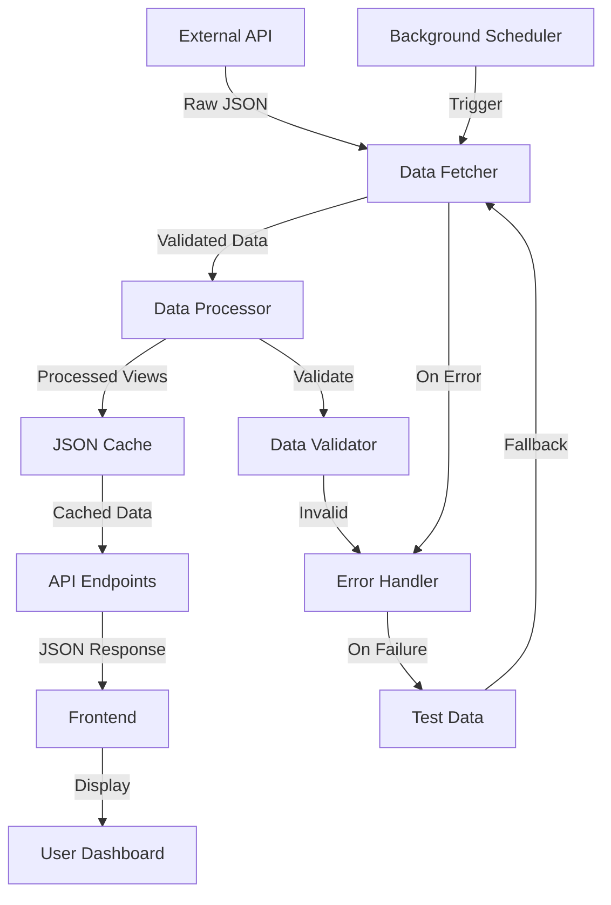

# Data Flow Architecture

Comprehensive documentation of data flow, processing pipeline, and caching strategy in SPMS.

## Data Flow Overview

SPMS implements a **multi-stage data processing pipeline** that transforms raw external API data into optimized dashboard views with intelligent caching and fallback strategies.

### Pipeline Architecture


## Data Sources

### 1. Primary Data Source: hollandsevelden.nl API
```yaml
Endpoint: https://api.hollandsevelden.nl/competities/2025-2026/oost/za/3n/
Authentication: API Key (x-api-key header)
Format: JSON
Update Frequency: Real-time (limited by our polling schedule)
Data Coverage: Dutch regional football leagues
```

**Raw API Response Structure**:
```json
{
  "3n": {
    "leaguetable": [
      {
        "name": "Team Name",
        "position": 1,
        "matches": 10,
        "wins": 8,
        "ties": 1,
        "losses": 1,
        "goalsFor": 25,
        "goalsAgainst": 8,
        "points": 25
      }
    ],
    "period1": [...],
    "period2": [...], 
    "period3": [...],
    "results": [...],
    "program": [...]
  }
}
```

**API Features**:
- **League standings**: Current table positions
- **Period standings**: Individual period results
- **Match results**: Historical match data
- **Match schedule**: Upcoming fixtures
- **Team statistics**: Goals, points, records

### 2. Fallback Data Source: Test Data
```yaml
Source: noord-zaterdag-1f.json (static file)
Purpose: Development testing and API failure fallback
Trigger: API unavailable, validation failure, or test mode
Data: Complete season dataset for development
```

**Fallback Strategy**:
1. **Automatic fallback**: API failures trigger immediate fallback
2. **Test mode**: Explicit test mode via `USE_TEST_DATA=true`
3. **Data validation**: Invalid API responses trigger fallback
4. **Development mode**: Test data used for offline development

## Data Processing Pipeline

### 1. Data Acquisition Layer (`hollandsevelden.py`)

#### API Client Implementation
```python
def get_data(use_test_data=None):
    """Fetch data from API or use test data based on configuration"""
    
    # Configuration-based mode switching
    if use_test_data is None:
        use_test_data = os.getenv('USE_TEST_DATA', 'false').lower() == 'true'
    
    if use_test_data:
        return get_test_data()
    
    # API request with error handling
    try:
        response = requests.get(
            apiUrl, 
            headers={"User-Agent": user_agent, "x-api-key": x_api_key},
            timeout=30
        )
        
        if response.status_code != 200:
            return get_test_data()  # Immediate fallback
            
        data = json.loads(response.text)
        return normalize_api_data(data)
        
    except Exception:
        return get_test_data()  # Fallback on any error
```

#### Data Normalization
**Purpose**: Convert varying API response formats to consistent internal structure

```python
def normalize_api_data(raw_data):
    """Normalize API response to consistent internal format"""
    normalized_leaguetable = []
    
    for team in leaguetable:
        normalized_team = {
            'team': team.get('name', team.get('team', '')),
            'position': team.get('position', 0),
            'played': team.get('matches', team.get('played', 0)),  # matches -> played
            'wins': team.get('wins', 0),
            'draws': team.get('ties', team.get('draws', 0)),      # ties -> draws
            'losses': team.get('losses', 0),
            'goals_for': team.get('goalsFor', team.get('goals_for', 0)),
            'goals_against': team.get('goalsAgainst', team.get('goals_against', 0)),
            'points': team.get('points', 0)
        }
        normalized_leaguetable.append(normalized_team)
```

### 2. Data Processing Layer

#### View Processors
**Purpose**: Transform raw data into dashboard-specific views

##### League Standings Processor
```python
def get_league_standings(data):
    """Process main league table"""
    return data.get('leaguetable', [])
```

##### Period Standings Processor
```python
def get_filtered_period_standings(data):
    """Get period standings where matches have been played"""
    filtered_periods = []
    
    for period_name in ['period1', 'period2', 'period3']:
        period_data = data.get(period_name, [])
        if period_data:
            # Only include periods with played matches
            has_matches = any(team.get('played', 0) > 0 for team in period_data)
            if has_matches:
                filtered_periods.append({
                    'name': period_name.replace('period', 'Periode '),
                    'standings': period_data
                })
    
    return filtered_periods
```

##### Results Processor
```python
def get_last_week_results(data):
    """Get results from the last 7 days"""
    if not data or 'results' not in data:
        return []
    
    # In test mode, return all results
    if Config.USE_TEST_DATA:
        return data['results']
    
    # Filter by date range
    now = datetime.now()
    week_ago = now - timedelta(days=7)
    
    filtered_results = []
    for result in data['results']:
        match_date = parse_date(result.get('date', ''))
        if match_date and week_ago <= match_date <= now:
            filtered_results.append(result)
    
    return filtered_results
```

##### Featured Team Processor
```python
def get_featured_team_matches(data):
    """Get all matches for the configured featured team"""
    featured_team_name = Config.FEATURED_TEAM
    
    all_results = data.get('results', [])
    all_program = data.get('program', [])
    
    played_matches = []
    upcoming_matches = []
    
    # Process played matches
    for match in all_results:
        if is_team_match(match, featured_team_name):
            played_matches.append(format_match(match, featured_team_name))
    
    # Process upcoming matches  
    for match in all_program:
        if is_team_match(match, featured_team_name):
            upcoming_matches.append(format_match(match, featured_team_name))
    
    return {
        'played': played_matches,
        'upcoming': upcoming_matches
    }
```

##### Team Matrix Processor
```python
def create_team_matrix(data):
    """Create team vs team results matrix"""
    teams = extract_all_teams(data)
    matrix = initialize_matrix(teams)
    
    # Process all matches to populate matrix
    for match in data.get('results', []):
        home_team = get_team_name(match, 'home')
        away_team = get_team_name(match, 'away')
        
        if home_team in teams and away_team in teams:
            matrix[home_team][away_team] = {
                'date': match.get('date'),
                'result': f"{match.get('homeGoals')}-{match.get('awayGoals')}",
                'venue': 'home' if home_team == featured_team else 'away'
            }
    
    return {'teams': teams, 'matrix': matrix}
```

### 3. Caching Layer (`scheduler.py`)

#### Cache Management
```python
class DataScheduler:
    def __init__(self):
        self.data_file = 'league_data.json'
        self.cached_data = None
        self.last_update = None
    
    def fetch_and_process_data(self):
        """Fetch and process all dashboard views"""
        raw_data = get_data(use_test_data=Config.USE_TEST_DATA)
        
        processed_data = {
            'raw_data': raw_data,
            'league_table': raw_data.get('leaguetable', []),
            'period_standings': get_filtered_period_standings(raw_data),
            'last_week_results': get_last_week_results(raw_data),
            'next_week_matches': get_next_week_matches(raw_data),
            'featured_team_matches': get_featured_team_matches(raw_data),
            'weekly_results': get_weekly_results(raw_data),
            'team_matrix': create_team_matrix(raw_data),
            'all_matches': get_all_matches(raw_data),
            'last_updated': datetime.now().isoformat()
        }
        
        # Persist to file and memory
        with open(self.data_file, 'w', encoding='utf-8') as f:
            json.dump(processed_data, f, ensure_ascii=False, indent=2)
        
        self.cached_data = processed_data
        self.last_update = datetime.now()
```

#### Cache Strategy
**Multi-level caching approach**:
1. **Memory cache**: In-memory `cached_data` for fastest access
2. **File cache**: `league_data.json` for persistence across restarts
3. **Fallback cache**: Test data as last resort

**Cache Invalidation**:
- **Time-based**: Scheduled updates trigger cache refresh
- **Mode-based**: Test/production mode switches invalidate cache
- **Error-based**: API failures trigger fallback but preserve stale cache

### 4. Scheduling System

#### Update Schedule Configuration
```python
class ScheduleConfig:
    DAILY_UPDATE_TIME = "10:00"
    
    # Saturday updates every 30 minutes during match hours
    SATURDAY_TIMES = [f"{hour}:{minute:02d}" 
                      for hour in range(16, 20) 
                      for minute in [0, 30]]
```

#### Scheduler Implementation
```python
def start_scheduler(self):
    """Start background data fetching scheduler"""
    # Daily maintenance update
    schedule.every().day.at(ScheduleConfig.DAILY_UPDATE_TIME).do(
        self.fetch_and_process_data
    )
    
    # Saturday intensive updates during match hours
    for time_slot in ScheduleConfig.SATURDAY_TIMES:
        schedule.every().saturday.at(time_slot).do(
            self.fetch_and_process_data
        )
    
    # Background thread for scheduler
    def run_scheduler():
        while True:
            schedule.run_pending()
            time.sleep(60)
    
    scheduler_thread = threading.Thread(target=run_scheduler, daemon=True)
    scheduler_thread.start()
```

## API Data Serving

### 1. Endpoint Architecture (`app.py`)
```python
API_DATA_MAPPINGS = {
    'data': {'key': None, 'wrapper': None},  # Return all data
    'standings': {'key': 'league_table', 'wrapper': 'league_table'},
    'period-standings': {'key': 'period_standings', 'wrapper': 'period_standings'},
    'last-week-results': {'key': 'last_week_results', 'wrapper': 'results'},
    'next-week-matches': {'key': 'next_week_matches', 'wrapper': 'matches'},
    'featured-team-matches': {'key': 'featured_team_matches', 'wrapper': 'featured_team_matches'},
    'weekly-results': {'key': 'weekly_results', 'wrapper': 'weekly_results'},
    'team-matrix': {'key': 'team_matrix', 'wrapper': 'team_matrix'},
    'all-matches': {'key': 'all_matches', 'wrapper': 'matches'},
}
```

### 2. Response Formatting
```python
def _format_api_response(data, data_key, wrapper_key):
    """Format API response with consistent structure"""
    if data_key is None:
        return jsonify(data)  # Return all data for main endpoint
    
    response = {
        wrapper_key: data.get(data_key, []),
        'last_updated': data.get('last_updated')
    }
    return jsonify(response)
```

### 3. Error Handling
```python
def _get_cached_data_with_error_handling():
    """Get cached data with consistent error handling"""
    data = data_scheduler.get_cached_data()
    if not data:
        return None, (jsonify({'error': 'No data available'}), 500)
    return data, None
```

## Frontend Data Flow

### 1. Data Loading (`dashboard.js`)
```javascript
async function loadData() {
    try {
        const response = await fetch('/api/data');
        if (!response.ok) {
            throw new Error(`HTTP error! status: ${response.status}`);
        }
        const data = await response.json();
        
        // Set global configuration
        featuredTeamName = data.featured_team_name || "Featured Team";
        
        // Build carousel slides
        buildCarouselSlides(data);
        
        return data;
    } catch (error) {
        console.error('Error loading data:', error);
        throw error;
    }
}
```

### 2. Dynamic Content Generation
```javascript
function addStandingsSlide(standings, allMatches) {
    const slideHtml = `
        <div class="carousel-item" data-slide="standings">
            <div class="slide-content">
                <h2>League Standings</h2>
                <table class="table table-striped">
                    ${generateStandingsTable(standings)}
                </table>
            </div>
        </div>
    `;
    
    document.getElementById('carousel-inner').insertAdjacentHTML('beforeend', slideHtml);
}
```

### 3. Real-time Updates
```javascript
// Auto-refresh data every 30 minutes
setInterval(async () => {
    try {
        await loadData();
        console.log('Data refreshed automatically');
    } catch (error) {
        console.error('Auto-refresh failed:', error);
    }
}, 30 * 60 * 1000); // 30 minutes
```

## Data Quality and Validation

### 1. Input Validation
```python
def validate_api_response(data):
    """Validate API response structure and data quality"""
    if not isinstance(data, dict):
        raise ValidationError("Invalid data format")
    
    # Required fields validation
    required_fields = ['leaguetable', 'results', 'program']
    for field in required_fields:
        if field not in data:
            raise ValidationError(f"Missing required field: {field}")
    
    # Data quality checks
    leaguetable = data.get('leaguetable', [])
    if not leaguetable:
        raise ValidationError("Empty league table")
    
    return True
```

### 2. Data Sanitization
```python
def sanitize_team_name(name):
    """Sanitize team names for safe display"""
    if not name:
        return "Unknown Team"
    
    # Remove potentially dangerous characters
    sanitized = re.sub(r'[<>&"\'`]', '', str(name))
    return sanitized.strip()[:50]  # Limit length
```

### 3. Error Recovery
```python
def handle_data_error(error, context):
    """Handle data processing errors with appropriate recovery"""
    logger.error(f"Data error in {context}: {error}")
    
    # Try to recover with cached data
    if os.path.exists('league_data.json'):
        with open('league_data.json', 'r') as f:
            return json.load(f)
    
    # Fallback to test data
    return get_test_data()
```

## Performance Characteristics

### 1. Data Processing Performance
- **API response time**: 500-2000ms (external dependency)
- **Data processing**: 50-100ms for full pipeline
- **Cache write**: 10-50ms for JSON serialization
- **Memory usage**: ~5-10MB for complete dataset

### 2. Cache Performance
- **Memory cache hit**: <1ms response time
- **File cache hit**: 5-10ms response time  
- **Cache miss**: Full pipeline execution (2-3 seconds)
- **Cache size**: ~100KB JSON file

### 3. API Serving Performance
- **Cached response**: 10-20ms average
- **JSON serialization**: 1-5ms for typical payloads
- **Network transfer**: Depends on client connection
- **Concurrent requests**: Efficient with caching

## Monitoring and Observability

### 1. Data Quality Metrics
- **API success rate**: Percentage of successful API calls
- **Data staleness**: Age of cached data
- **Processing errors**: Failed data processing operations
- **Fallback usage**: Frequency of test data fallback

### 2. Performance Metrics
- **Cache hit rate**: Memory vs. file vs. API calls
- **Response times**: P50, P95, P99 percentiles
- **Data size**: Payload sizes and growth trends
- **Update frequency**: Actual vs. scheduled update frequency

### 3. Error Monitoring
- **API failures**: External API downtime or errors
- **Processing failures**: Data transformation errors
- **Cache corruption**: File system or serialization errors
- **Client errors**: Frontend data loading failures

This data flow architecture ensures reliable, performant, and maintainable data delivery from external sources to the user dashboard with multiple layers of error handling and performance optimization.