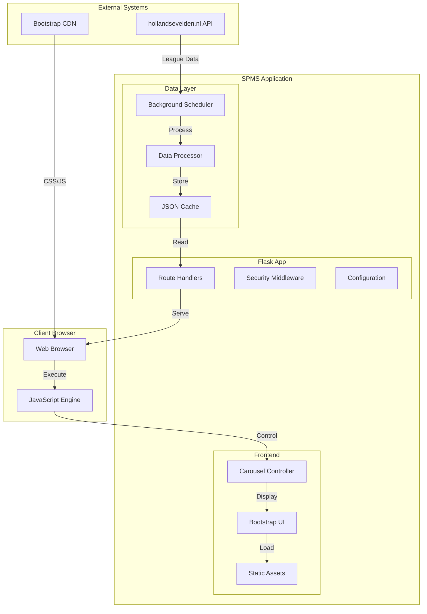

# System Overview

High-level architectural overview of the Sports League Management System (SPMS).

## System Purpose

SPMS is a Flask-based dashboard application designed to display Dutch regional football league data in a rotating carousel format. It serves as a digital display solution for sports clubs, bars, or public venues to show real-time league information.

## Architecture Principles

### 1. Simplicity First
- **Zero-database architecture** for minimal operational complexity
- **File-based caching** with JSON persistence
- **Stateless design** enabling easy horizontal scaling
- **Minimal dependencies** reducing maintenance overhead

### 2. Reliability & Resilience
- **Graceful degradation** when external APIs fail
- **Fallback data strategies** ensuring continuous operation
- **Robust error handling** throughout the data pipeline
- **Automatic recovery** from transient failures

### 3. Security by Design
- **Defense in depth** with multiple security layers
- **Strict CSP headers** preventing XSS attacks
- **CSRF protection** on all state-changing operations
- **Security headers** following OWASP recommendations

### 4. Performance Optimization
- **Intelligent caching** minimizing API calls
- **Asset optimization** for fast load times
- **Efficient data structures** reducing memory usage
- **Responsive design** optimized for various screen sizes

## High-Level Architecture



## Core Components

### 1. Flask Application Core (`app.py`)
**Purpose**: Main application server handling HTTP requests and responses

**Key Responsibilities**:
- Route handling for dashboard and API endpoints
- Security middleware (CSRF, security headers)
- Error handling (404, 500)
- Configuration management
- Static file serving

**Key Features**:
- **Security headers**: X-XSS-Protection, X-Frame-Options, CSP
- **CSRF protection**: Flask-WTF integration
- **API abstraction**: Consistent error handling across endpoints
- **Environment-aware**: Debug mode controlled by `FLASK_ENV`

### 2. Data Processing Pipeline (`hollandsevelden.py`)
**Purpose**: External API integration and data transformation

**Key Responsibilities**:
- Fetching data from hollandsevelden.nl API
- Data structure normalization and validation
- Multi-view data processing (standings, results, schedules)
- Error handling and fallback strategies
- Test data integration for development

**Data Processing Views**:
- **League standings**: Main competition table
- **Period standings**: Filtered periods with played matches
- **Weekly results**: Last 7 days of match results
- **Upcoming matches**: Next 7 days of scheduled matches
- **Featured team matches**: Team-specific match history and schedule
- **Team matrix**: Head-to-head results between all teams
- **All matches**: Complete match database

### 3. Background Scheduler (`scheduler.py`)
**Purpose**: Automated data fetching and cache management

**Key Responsibilities**:
- Scheduled data updates (daily 10:00 AM, Saturday every 30 minutes)
- Cache invalidation and refresh
- Error recovery and retry logic
- Performance monitoring and logging
- Test/production mode switching

**Scheduling Strategy**:
```python
# Daily updates for general maintenance
DAILY_UPDATE = "10:00"

# Saturday intensive updates during match hours
SATURDAY_UPDATES = [
    "16:00", "16:30", "17:00", "17:30", 
    "18:00", "18:30", "19:00", "19:30"
]
```

### 4. Configuration Management (`config.py`)
**Purpose**: Environment-specific configuration and settings

**Configuration Classes**:
- **`Config`**: Main application settings
- **`ScheduleConfig`**: Data fetching schedule configuration  
- **`TeamFieldMappings`**: Data field normalization mappings

**Environment Support**:
- Development vs. Production modes
- Test data vs. Live API switching
- Featured team configuration
- Security settings (SECRET_KEY, DEBUG)

### 5. Frontend Carousel System
**Purpose**: Dynamic dashboard with rotating screens

**Architecture Components**:
- **Bootstrap 5 Carousel**: Base carousel functionality
- **JavaScript Controller**: Custom carousel logic and data loading
- **Template System**: Jinja2 templates with component includes
- **Asset Management**: Team logos, icons, and styling

**Screen Types** (6 total):
1. **Intro Screen**: Branding and system status
2. **Main Standings**: League table with current positions
3. **Period Standings**: Individual period tables (1-3)
4. **Last Week Results**: Recent match results
5. **Next Week Matches**: Upcoming fixtures
6. **Featured Team Matches**: Team-specific match overview
7. **Team Matrix**: Head-to-head results grid

## Data Flow Architecture

### 1. Data Acquisition
```
External API → HTTP Request → JSON Response → Validation → Normalization
```

### 2. Data Processing
```
Raw Data → View Processors → Transformed Data → Cache Storage
```

### 3. Data Serving
```
Cache → API Endpoints → JSON Response → Frontend → User Display
```

### 4. Cache Management
```
Scheduler → Fetch Data → Process Views → Update Cache → Serve Fresh Data
```

## Security Architecture

### 1. Input Validation
- **Data sanitization** at API boundaries
- **JSON schema validation** for external data
- **Parameter validation** for all endpoints

### 2. Output Protection
- **XSS prevention** through CSP headers
- **Content-Type validation** preventing MIME confusion
- **Safe rendering** with Jinja2 auto-escaping

### 3. Infrastructure Security
- **HTTPS enforcement** in production
- **Secure session configuration**
- **Error information disclosure** prevention

### 4. CSRF Protection
- **Token-based protection** for state changes
- **API endpoint exemptions** for read-only operations
- **Double-submit cookies** validation

## Performance Characteristics

### 1. Response Time Profile
- **Cached data**: < 50ms (average)
- **Fresh data fetch**: < 2000ms (95th percentile)
- **Static assets**: < 100ms (with CDN)
- **Carousel transitions**: 60fps smooth animations

### 2. Resource Utilization
- **Memory footprint**: ~50MB base + ~10MB per cached dataset
- **CPU usage**: < 5% during normal operations
- **Disk I/O**: Minimal (JSON file operations only)
- **Network**: Bandwidth efficient with caching

### 3. Scalability Limits
- **Concurrent users**: 100-500 (single instance)
- **Data volume**: Optimized for regional leagues (20-30 teams)
- **Update frequency**: Up to every 30 minutes without performance degradation
- **Asset serving**: 500+ team logos efficiently cached

## Error Handling Strategy

### 1. Graceful Degradation
- **API failures**: Fallback to cached data
- **Cache corruption**: Automatic regeneration
- **Missing assets**: Default images and styling
- **JavaScript errors**: Basic HTML fallbacks

### 2. Error Recovery
- **Automatic retry**: Exponential backoff for API calls
- **Circuit breaker**: Prevent cascade failures
- **Health checks**: System self-monitoring
- **Alerting**: Error notification system

### 3. User Experience
- **Loading states**: Clear progress indicators
- **Error messages**: User-friendly error reporting
- **Fallback content**: Meaningful defaults
- **Performance**: Maintain 60fps during errors

## Integration Points

### 1. External API Integration
- **Primary**: hollandsevelden.nl (Dutch football data)
- **Authentication**: API key-based authentication
- **Rate limiting**: Respectful API usage patterns
- **Data format**: JSON with field normalization

### 2. CDN Integration
- **Bootstrap 5**: CSS and JavaScript framework
- **Font loading**: Web font optimization
- **Asset delivery**: Fast global content delivery

### 3. Development Tools
- **Poetry/pip**: Dependency management
- **Ruff**: Code linting and formatting
- **Pyright**: Type checking and validation
- **GitHub**: Version control and CI/CD

## Deployment Architecture

### 1. Production Environment
- **Web server**: Gunicorn WSGI server
- **Reverse proxy**: Nginx (recommended)
- **Process management**: systemd or supervisor
- **Environment**: Linux-based containers or VMs

### 2. Development Environment
- **Local server**: Flask development server
- **Virtual environment**: Poetry or venv
- **Hot reload**: Automatic restart on file changes
- **Debug mode**: Enhanced error reporting

### 3. Configuration Management
- **Environment variables**: `.env` file configuration
- **Secrets management**: External secret providers
- **Feature flags**: Environment-based feature toggles
- **Monitoring**: Application and infrastructure monitoring

## Monitoring and Observability

### 1. Application Monitoring
- **Health checks**: `/health` endpoint for load balancer integration
- **Performance metrics**: Response time and throughput tracking
- **Error tracking**: Exception monitoring and alerting
- **Data freshness**: Cache staleness monitoring

### 2. Infrastructure Monitoring
- **Resource usage**: CPU, memory, disk monitoring
- **Network health**: API connectivity and latency
- **Log aggregation**: Centralized logging system
- **Alerting**: Proactive issue notification

### 3. Business Metrics
- **Usage analytics**: Dashboard view statistics
- **Data quality**: API success rates and data completeness
- **Performance KPIs**: Load time and user experience metrics
- **Availability SLA**: System uptime and reliability tracking

## Technology Stack Summary

| Component | Technology | Version | Purpose |
|-----------|------------|---------|---------|
| **Backend** | Flask | 3.0.0 | Web application framework |
| **Scheduler** | schedule | 1.2.0 | Background task scheduling |
| **Security** | Flask-WTF | 1.2.2 | CSRF protection |
| **HTTP Client** | requests | 2.32.2 | External API integration |
| **Frontend** | Bootstrap | 5.3.x | UI framework and components |
| **JavaScript** | Vanilla JS | ES6+ | Client-side logic |
| **Python** | Python | 3.10+ | Runtime environment |
| **Server** | Gunicorn | 21.2.0 | Production WSGI server |

This architecture provides a solid foundation for the current SPMS implementation while maintaining flexibility for future enhancements and multi-team expansion.