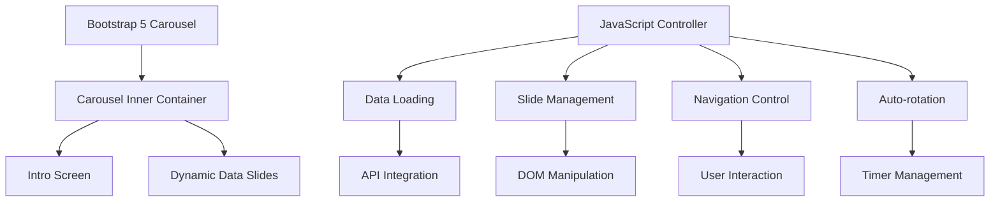

# Carousel Dashboard System

Comprehensive documentation of the SPMS carousel-based dashboard architecture, implementation, and customization.

## System Overview

The SPMS dashboard uses a **6-screen rotating carousel** built on Bootstrap 5 carousel component with custom JavaScript controls for displaying league data. The system provides automatic screen rotation, manual navigation, and dynamic content loading.

### Architecture Philosophy
- **Bootstrap-based**: Leverages Bootstrap 5 carousel for core functionality
- **Progressive enhancement**: Works with basic HTML, enhanced with JavaScript
- **Mobile-first**: Responsive design for all screen sizes
- **Accessibility-focused**: Keyboard navigation and screen reader support
- **Performance-optimized**: Efficient DOM manipulation and smooth transitions

## Carousel Architecture

### 1. Core Components


### 2. Screen Types
The carousel displays 6 different screen types:

1. **Intro Screen** (Static)
   - Branding and system status
   - Test mode indicator
   - Always first slide

2. **League Standings** (Dynamic)
   - Main competition table
   - Team positions and statistics
   - Real-time point calculations

3. **Period Standings** (Dynamic)
   - Individual period tables (1-3 periods)
   - Only shows periods with played matches
   - Filtered based on match activity

4. **Last Week Results** (Dynamic)
   - Recent match results (7 days)
   - Score details and dates
   - Chronological ordering

5. **Next Week Matches** (Dynamic)
   - Upcoming fixtures (7 days)
   - Schedule and venue information
   - Date/time details

6. **Featured Team Matches** (Dynamic)
   - Team-specific match overview
   - Historical and upcoming matches
   - Win/loss indicators

7. **Team Matrix** (Dynamic)
   - Head-to-head results grid
   - Complete matchup overview
   - Visual result representation

## Template Architecture

### 1. Main Dashboard Template
**File**: `templates/dashboard.html`

```html
<!DOCTYPE html>
<html lang="nl">
  
  <body>
    <div class="container-fluid p-0">
      <!-- Bootstrap 5 Carousel -->
      <div id="carousel" class="carousel slide">
        <div class="carousel-inner" id="carousel-inner">
          
          <!-- Dynamic slides added by JavaScript -->
        </div>
        
        
      </div>
      
      
      
    </div>

    
  </body>
</html>
```

### 2. Template Includes Structure
```
templates/
├── dashboard.html              # Main template
└── includes/
    ├── head.html              # HTML head section
    ├── carousel_controls.html  # Navigation controls
    ├── footer.html            # Footer content
    ├── intro_screen.html      # Static intro slide
    ├── scripts.html           # JavaScript includes
    └── test_mode_indicator.html # Development mode indicator
```

#### Head Include (`includes/head.html`)
```html
<head>
    <meta charset="UTF-8">
    <meta name="viewport" content="width=device-width, initial-scale=1.0">
    <title>SPMS Liga Dashboard</title>
    
    <!-- Bootstrap 5 CSS -->
    <link href="https://cdn.jsdelivr.net/npm/bootstrap@5.3.0/dist/css/bootstrap.min.css" rel="stylesheet">
    
    <!-- Custom CSS -->
    <link rel="stylesheet" href="{{ url_for('static', filename='css/dashboard.css') }}">
    
    <!-- Favicon -->
    <link rel="icon" href="{{ url_for('static', filename='images/favicon.png') }}" type="image/png">
    
    <!-- Security and SEO Meta Tags -->
    <meta name="description" content="Sports League Management System Dashboard">
    <meta name="robots" content="noindex, nofollow">
</head>
```

#### Intro Screen (`includes/intro_screen.html`)
```html
<div class="carousel-item active intro-screen">
    <div class="slide-content">
        <div class="text-center">
            
            
            <h1 id="competition-main-title" class="display-4 text-primary mb-3">
                LIGA DASHBOARD
            </h1>
            
            <h2 class="h3 text-secondary mb-4">
                Zaterdag 3N - Seizoen 2025/2026
            </h2>
            
            <div class="status-info">
                <p id="competition-status" class="lead text-muted">
                    Dashboard laden...
                </p>
                
                <div class="data-info mt-3">
                    <small class="text-muted">
                        <i class="fas fa-sync-alt"></i>
                        Updates: Dagelijks 10:00 | Za 16:00-19:00 (elke 30 min)
                    </small>
                </div>
            </div>
        </div>
    </div>
</div>
```

#### Carousel Controls (`includes/carousel_controls.html`)
```html
<!-- Carousel Indicators -->
<div class="carousel-indicators" id="carousel-indicators">
    <!-- Dynamically generated by JavaScript -->
</div>

<!-- Carousel Navigation -->
<button class="carousel-control-prev" type="button" data-bs-target="#carousel" data-bs-slide="prev">
    <span class="carousel-control-prev-icon" aria-hidden="true"></span>
    <span class="visually-hidden">Previous</span>
</button>

<button class="carousel-control-next" type="button" data-bs-target="#carousel" data-bs-slide="next">
    <span class="carousel-control-next-icon" aria-hidden="true"></span>
    <span class="visually-hidden">Next</span>
</button>

<!-- Manual Controls -->
<div class="carousel-manual-controls">
    <button id="pause-btn" class="btn btn-outline-light btn-sm">
        <i class="fas fa-pause"></i>
        Pause
    </button>
    
    <button id="refresh-btn" class="btn btn-outline-light btn-sm">
        <i class="fas fa-sync-alt"></i>
        Refresh
    </button>
</div>
```

## JavaScript Architecture

### 1. Core JavaScript Structure
**File**: `static/js/dashboard.js`

```javascript
// Global Configuration
let SCREEN_DURATION_SECONDS = 10; // Configurable via template
let carouselInstance = null;
let countdownInterval = null;
let currentCountdown = SCREEN_DURATION_SECONDS;
let totalSlides = 0;
let featuredTeamName = "";
let carouselInitialized = false;

// Main initialization
document.addEventListener('DOMContentLoaded', function() {
    loadData().then(() => {
        initializeCarousel();
        updateCompetitionStatus('Dashboard geladen - Carousel actief');
    }).catch(error => {
        console.error('Data loading failed:', error);
        updateCompetitionStatus('Dashboard geladen - Beperkte functionaliteit');
    });
});
```

### 2. Data Loading System
```javascript
async function loadData() {
    try {
        console.log('Loading data from /api/data...');
        const response = await fetch('/api/data');
        
        if (!response.ok) {
            throw new Error(`HTTP error! status: ${response.status}`);
        }
        
        const data = await response.json();
        console.log('Data loaded:', data);
        
        // Set global configuration
        featuredTeamName = data.featured_team_name || "Featured Team";
        updateTeamName();
        
        // Check test mode
        checkTestMode(data);
        
        // Build carousel slides
        clearExistingSlides();
        buildAllSlides(data);
        
        return data;
    } catch (error) {
        console.error('Error loading data:', error);
        throw error;
    }
}

function clearExistingSlides() {
    const carouselInner = document.getElementById('carousel-inner');
    const introSlide = carouselInner.querySelector('.intro-screen');
    
    // Keep intro slide, remove others
    const otherSlides = carouselInner.querySelectorAll('.carousel-item:not(.intro-screen)');
    otherSlides.forEach(slide => slide.remove());
}
```

### 3. Dynamic Slide Generation
```javascript
function buildAllSlides(data) {
    // Add main standings slide
    addStandingsSlide(data.league_table || [], data.all_matches || []);
    
    // Add period slides (only if matches played)
    if (data.raw_data) {
        if (data.raw_data.period1) addPeriodSlide(data.raw_data.period1, 'Periode 1', 'period1');
        if (data.raw_data.period2) addPeriodSlide(data.raw_data.period2, 'Periode 2', 'period2');
        if (data.raw_data.period3) addPeriodSlide(data.raw_data.period3, 'Periode 3', 'period3');
    }
    
    // Add results and fixtures slides
    addLastWeekResultsSlide(data.last_week_results || []);
    addNextWeekMatchesSlide(data.next_week_matches || []);
    
    // Add featured team and matrix slides
    addFeaturedMatchesSlide(data.featured_team_matches || {played: [], upcoming: []});
    addTeamMatrixSlide(data.team_matrix || {teams: [], matrix: {}});
    
    console.log('All slides added successfully');
}

function addStandingsSlide(standings, allMatches) {
    const slideHtml = `
        <div class="carousel-item" data-slide="standings">
            <div class="slide-content">
                <h2 class="slide-title text-center mb-4">
                    <i class="fas fa-trophy text-warning"></i>
                    Liga Stand
                </h2>
                <div class="table-container">
                    ${generateStandingsTable(standings)}
                </div>
                <div class="slide-footer">
                    <small class="text-muted">
                        <i class="fas fa-calendar"></i>
                        Totaal ${allMatches.length} wedstrijden dit seizoen
                    </small>
                </div>
            </div>
        </div>
    `;
    
    insertSlide(slideHtml);
}
```

### 4. Table Generation Functions
```javascript
function generateStandingsTable(standings) {
    if (!standings || standings.length === 0) {
        return '<p class="text-center text-muted">Geen gegevens beschikbaar</p>';
    }
    
    let tableHtml = `
        <table class="table table-striped table-hover standings-table">
            <thead class="table-dark">
                <tr>
                    <th class="text-center">#</th>
                    <th>Team</th>
                    <th class="text-center">GS</th>
                    <th class="text-center">W</th>
                    <th class="text-center">G</th>
                    <th class="text-center">V</th>
                    <th class="text-center">DV</th>
                    <th class="text-center">PT</th>
                </tr>
            </thead>
            <tbody>
    `;
    
    standings.forEach((team, index) => {
        const goalDiff = team.goals_for - team.goals_against;
        const goalDiffClass = goalDiff > 0 ? 'text-success' : goalDiff < 0 ? 'text-danger' : 'text-muted';
        
        tableHtml += `
            <tr class="team-row ${team.team === featuredTeamName ? 'table-warning' : ''}">
                <td class="text-center position-cell">${team.position}</td>
                <td class="team-name">
                    <div class="d-flex align-items-center">
                        
                        <span>${team.team}</span>
                    </div>
                </td>
                <td class="text-center">${team.played}</td>
                <td class="text-center text-success">${team.wins}</td>
                <td class="text-center text-warning">${team.draws}</td>
                <td class="text-center text-danger">${team.losses}</td>
                <td class="text-center ${goalDiffClass}">${goalDiff > 0 ? '+' : ''}${goalDiff}</td>
                <td class="text-center fw-bold">${team.points}</td>
            </tr>
        `;
    });
    
    tableHtml += '</tbody></table>';
    return tableHtml;
}

function getTeamLogo(teamName) {
    // Map team names to logo files
    const logoMap = {
        'AVV Columbia': 'static/images/team_logos/t_100.png',
        'VV Gorecht': 'static/images/team_logos/t_101.png',
        // ... more team mappings
    };
    
    return logoMap[teamName] || 'static/images/team_logos/default_team.png';
}
```

### 5. Carousel Control System
```javascript
function initializeCarousel() {
    const carouselElement = document.getElementById('carousel');
    
    // Initialize Bootstrap carousel
    carouselInstance = new bootstrap.Carousel(carouselElement, {
        interval: false,  // Disable auto-advance (we control it manually)
        keyboard: true,   // Enable keyboard navigation
        pause: 'hover',   // Pause on hover
        ride: false,      // Don't start automatically
        wrap: true        // Enable infinite loop
    });
    
    // Update slide count
    totalSlides = document.querySelectorAll('.carousel-item').length;
    console.log(`Carousel initialized with ${totalSlides} slides`);
    
    // Setup custom controls
    setupCarouselControls();
    
    // Start auto-rotation
    startAutoRotation();
    
    // Generate indicators
    generateIndicators();
    
    carouselInitialized = true;
}

function setupCarouselControls() {
    // Pause/Resume button
    const pauseBtn = document.getElementById('pause-btn');
    if (pauseBtn) {
        pauseBtn.addEventListener('click', toggleAutoRotation);
    }
    
    // Refresh button  
    const refreshBtn = document.getElementById('refresh-btn');
    if (refreshBtn) {
        refreshBtn.addEventListener('click', refreshData);
    }
    
    // Carousel events
    const carousel = document.getElementById('carousel');
    carousel.addEventListener('slide.bs.carousel', handleSlideStart);
    carousel.addEventListener('slid.bs.carousel', handleSlideEnd);
    
    // Keyboard controls
    document.addEventListener('keydown', handleKeyboardInput);
}

function startAutoRotation() {
    if (countdownInterval) {
        clearInterval(countdownInterval);
    }
    
    currentCountdown = SCREEN_DURATION_SECONDS;
    
    countdownInterval = setInterval(() => {
        currentCountdown--;
        
        if (currentCountdown <= 0) {
            if (carouselInstance) {
                carouselInstance.next();
            }
            currentCountdown = SCREEN_DURATION_SECONDS;
        }
        
        updateCountdownDisplay();
    }, 1000);
}
```

## Styling and CSS

### 1. Custom CSS Structure
**File**: `static/css/dashboard.css`

```css
/* ===== CAROUSEL STYLES ===== */
.carousel {
    height: 100vh;
    background: linear-gradient(135deg, #667eea 0%, #764ba2 100%);
}

.carousel-inner {
    height: 100%;
}

.carousel-item {
    height: 100vh;
    display: flex;
    align-items: center;
    justify-content: center;
    padding: 20px;
}

.slide-content {
    background: rgba(255, 255, 255, 0.95);
    border-radius: 15px;
    padding: 30px;
    box-shadow: 0 8px 32px rgba(0, 0, 0, 0.1);
    backdrop-filter: blur(10px);
    max-width: 1200px;
    width: 100%;
    max-height: 90vh;
    overflow-y: auto;
}

/* ===== INTRO SCREEN STYLES ===== */
.intro-screen .slide-content {
    text-align: center;
    padding: 50px;
}

.club-logo {
    max-height: 120px;
    width: auto;
}

.competition-main-title {
    background: linear-gradient(45deg, #667eea, #764ba2);
    background-clip: text;
    -webkit-background-clip: text;
    -webkit-text-fill-color: transparent;
    font-weight: 700;
}

/* ===== TABLE STYLES ===== */
.standings-table {
    font-size: 14px;
}

.standings-table th {
    border: none;
    font-weight: 600;
    text-transform: uppercase;
    font-size: 12px;
    padding: 12px 8px;
}

.standings-table td {
    border: none;
    padding: 10px 8px;
    vertical-align: middle;
}

.team-row.table-warning {
    background-color: rgba(255, 193, 7, 0.2) !important;
    border-left: 4px solid #ffc107;
}

.team-logo {
    width: 24px;
    height: 24px;
    object-fit: contain;
    border-radius: 2px;
}

.position-cell {
    font-weight: 600;
    color: #495057;
}

/* ===== RESPONSIVE DESIGN ===== */
@media (max-width: 768px) {
    .carousel-item {
        padding: 10px;
    }
    
    .slide-content {
        padding: 20px;
        margin: 10px;
    }
    
    .standings-table {
        font-size: 12px;
    }
    
    .standings-table th,
    .standings-table td {
        padding: 6px 4px;
    }
    
    .team-logo {
        width: 20px;
        height: 20px;
    }
    
    .club-logo {
        max-height: 80px;
    }
}

/* ===== CAROUSEL CONTROLS ===== */
.carousel-control-prev,
.carousel-control-next {
    width: 5%;
    opacity: 0.7;
}

.carousel-control-prev:hover,
.carousel-control-next:hover {
    opacity: 1;
}

.carousel-indicators {
    bottom: 20px;
}

.carousel-indicators button {
    width: 12px;
    height: 12px;
    border-radius: 50%;
    margin: 0 3px;
}

.carousel-manual-controls {
    position: absolute;
    top: 20px;
    right: 20px;
    z-index: 1000;
}

.carousel-manual-controls .btn {
    margin-left: 10px;
    backdrop-filter: blur(10px);
    background: rgba(255, 255, 255, 0.2);
    border: 1px solid rgba(255, 255, 255, 0.3);
    color: white;
}

/* ===== TEST MODE INDICATOR ===== */
.test-mode-indicator {
    position: fixed;
    top: 10px;
    left: 10px;
    background: #ff6b6b;
    color: white;
    padding: 8px 16px;
    border-radius: 20px;
    font-weight: 600;
    font-size: 14px;
    z-index: 9999;
    box-shadow: 0 4px 12px rgba(255, 107, 107, 0.3);
    animation: pulse 2s infinite;
}

@keyframes pulse {
    0% { opacity: 1; }
    50% { opacity: 0.7; }
    100% { opacity: 1; }
}

/* ===== LOADING STATES ===== */
.loading-spinner {
    display: inline-block;
    width: 20px;
    height: 20px;
    border: 3px solid rgba(0, 0, 0, 0.1);
    border-radius: 50%;
    border-top-color: #007bff;
    animation: spin 1s ease-in-out infinite;
}

@keyframes spin {
    to { transform: rotate(360deg); }
}

/* ===== ACCESSIBILITY ===== */
@media (prefers-reduced-motion: reduce) {
    .carousel-item {
        transition: none;
    }
    
    .loading-spinner,
    .test-mode-indicator {
        animation: none;
    }
}

/* Focus indicators */
.carousel-control-prev:focus,
.carousel-control-next:focus,
.carousel-indicators button:focus {
    outline: 2px solid #007bff;
    outline-offset: 2px;
}
```

## Performance Optimization

### 1. DOM Manipulation Efficiency
```javascript
// Efficient slide insertion
function insertSlide(slideHtml) {
    const carouselInner = document.getElementById('carousel-inner');
    carouselInner.insertAdjacentHTML('beforeend', slideHtml);
}

// Batch DOM updates
function updateMultipleSlides(slidesData) {
    const fragment = document.createDocumentFragment();
    
    slidesData.forEach(slideData => {
        const slideElement = createSlideElement(slideData);
        fragment.appendChild(slideElement);
    });
    
    document.getElementById('carousel-inner').appendChild(fragment);
}
```

### 2. Memory Management
```javascript
// Cleanup intervals on page unload
window.addEventListener('beforeunload', function() {
    if (countdownInterval) {
        clearInterval(countdownInterval);
    }
    
    if (refreshInterval) {
        clearInterval(refreshInterval);
    }
});

// Efficient image loading
function preloadTeamLogos(teams) {
    teams.forEach(team => {
        const img = new Image();
        img.src = getTeamLogo(team.team);
    });
}
```

### 3. Animation Performance
```css
/* Use transform for smooth animations */
.carousel-item {
    will-change: transform;
}

/* GPU acceleration for smooth transitions */
.slide-content {
    transform: translateZ(0);
}
```

## Accessibility Features

### 1. Keyboard Navigation
```javascript
function handleKeyboardInput(event) {
    switch(event.key) {
        case 'ArrowLeft':
            event.preventDefault();
            carouselInstance.prev();
            break;
        case 'ArrowRight':
            event.preventDefault();
            carouselInstance.next();
            break;
        case ' ':
            event.preventDefault();
            toggleAutoRotation();
            break;
        case 'Home':
            event.preventDefault();
            carouselInstance.to(0);
            break;
        case 'End':
            event.preventDefault();
            carouselInstance.to(totalSlides - 1);
            break;
    }
}
```

### 2. Screen Reader Support
```html
<!-- ARIA labels for screen readers -->
<div id="carousel" class="carousel slide" 
     role="region" 
     aria-label="League Dashboard Carousel"
     aria-live="polite">
    
    <div class="carousel-inner" role="tabpanel" aria-labelledby="slide-title">
        <!-- Slides with proper headings -->
    </div>
    
    <!-- Accessible indicators -->
    <div class="carousel-indicators" role="tablist">
        <button type="button" 
                role="tab" 
                aria-label="Go to slide 1"
                aria-selected="true"></button>
    </div>
</div>
```

### 3. Reduced Motion Support
```css
@media (prefers-reduced-motion: reduce) {
    .carousel-item {
        transition: none;
    }
    
    .loading-spinner {
        animation: none;
    }
}
```

## Configuration and Customization

### 1. Timing Configuration
```javascript
// Configurable via template
let SCREEN_DURATION_SECONDS = {{ screen_duration_seconds }};

// Runtime adjustment
function adjustScreenDuration(seconds) {
    SCREEN_DURATION_SECONDS = seconds;
    if (countdownInterval) {
        startAutoRotation(); // Restart with new timing
    }
}
```

### 2. Theme Customization
```css
:root {
    --primary-gradient: linear-gradient(135deg, #667eea 0%, #764ba2 100%);
    --slide-background: rgba(255, 255, 255, 0.95);
    --accent-color: #ffc107;
    --text-primary: #212529;
    --text-secondary: #6c757d;
}

/* Dark theme variant */
[data-theme="dark"] {
    --slide-background: rgba(33, 37, 41, 0.95);
    --text-primary: #ffffff;
    --text-secondary: #adb5bd;
}
```

### 3. Feature Toggles
```javascript
const features = {
    autoRotation: true,
    manualControls: true,
    keyboardNavigation: true,
    testModeIndicator: true,
    periodicRefresh: true
};

function toggleFeature(featureName, enabled) {
    features[featureName] = enabled;
    
    switch(featureName) {
        case 'autoRotation':
            enabled ? startAutoRotation() : stopAutoRotation();
            break;
        case 'manualControls':
            toggleManualControls(enabled);
            break;
    }
}
```

This carousel system provides a robust, accessible, and customizable foundation for displaying sports league data with smooth animations, responsive design, and comprehensive user interaction support.