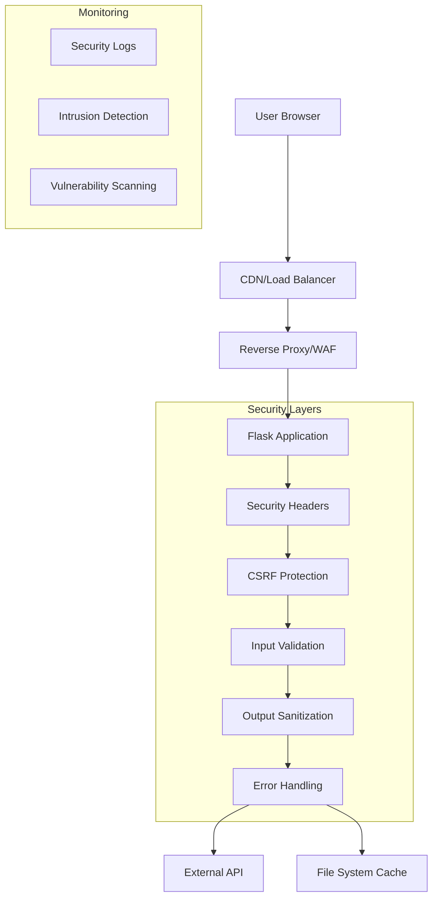

# Security Overview

Comprehensive security architecture, implementation, and best practices for SPMS.

## Security Philosophy

SPMS implements a **defense-in-depth security strategy** with multiple layers of protection:
- **Prevention**: Proactive security measures to prevent attacks
- **Detection**: Monitoring and alerting for security events
- **Response**: Incident response and recovery procedures
- **Compliance**: Adherence to security best practices and standards

### Security Principles
1. **Security by Default**: Secure configurations out-of-the-box
2. **Least Privilege**: Minimal permissions and access rights
3. **Defense in Depth**: Multiple security layers and controls
4. **Zero Trust**: Verify everything, trust nothing
5. **Fail Securely**: Graceful failure without exposing sensitive data

## Threat Model

### 1. Identified Threats

#### External Threats
- **Web Application Attacks**: XSS, CSRF, injection attacks
- **Network Attacks**: DDoS, man-in-the-middle attacks
- **API Abuse**: Rate limiting bypass, data scraping
- **Social Engineering**: Phishing, credential theft

#### Internal Threats
- **Privilege Escalation**: Unauthorized access to admin functions
- **Data Exfiltration**: Unauthorized data access or download
- **Configuration Tampering**: Malicious configuration changes
- **Supply Chain**: Compromised dependencies or packages

#### System Threats
- **Infrastructure Vulnerabilities**: Server, OS, network vulnerabilities
- **Application Vulnerabilities**: Code flaws, logic errors
- **Third-party Risks**: External API compromises
- **Data Integrity**: Data corruption or manipulation

### 2. Risk Assessment Matrix

| Threat Category | Likelihood | Impact | Risk Level | Mitigation Status |
|----------------|------------|--------|------------|-------------------|
| XSS Attacks | Medium | High | High | ✅ Implemented |
| CSRF Attacks | Medium | Medium | Medium | ✅ Implemented |
| API Abuse | Low | Low | Low | ⚠️ Partial |
| Data Breach | Low | High | Medium | ✅ Implemented |
| DDoS | Low | Medium | Low | ❌ Not Implemented |
| SQL Injection | Very Low | High | Low | ✅ N/A (No DB) |

## Security Architecture

### 1. Application Security Stack



### 2. Security Controls Implementation

#### HTTP Security Headers (`app.py`)
```python
@app.after_request
def set_security_headers(response):
    """Apply comprehensive security headers to all responses"""
    
    # Prevent XSS attacks
    response.headers['X-Content-Type-Options'] = 'nosniff'
    response.headers['X-Frame-Options'] = 'DENY'
    response.headers['X-XSS-Protection'] = '1; mode=block'
    
    # HTTPS enforcement (production only)
    if not app.debug:
        response.headers['Strict-Transport-Security'] = 'max-age=31536000; includeSubDomains'
    
    # Content Security Policy - restrictive but functional
    csp = (
        "default-src 'self'; "
        "script-src 'self' https://cdn.jsdelivr.net 'unsafe-inline'; "
        "style-src 'self' https://cdn.jsdelivr.net 'unsafe-inline'; "
        "img-src 'self' data:; "
        "font-src 'self' https://cdn.jsdelivr.net; "
        "connect-src 'self';"
    )
    response.headers['Content-Security-Policy'] = csp
    
    # Additional security headers
    response.headers['Referrer-Policy'] = 'strict-origin-when-cross-origin'
    response.headers['Permissions-Policy'] = 'geolocation=(), microphone=(), camera=()'
    
    return response
```

#### CSRF Protection
```python
from flask_wtf.csrf import CSRFProtect

# Initialize CSRF protection
csrf = CSRFProtect(app)

# Exempt API endpoints (read-only)
csrf.exempt('api')
```

## Input Validation and Sanitization

### 1. Data Validation Framework

#### API Input Validation
```python
from werkzeug.datastructures import ImmutableDict
import re

class SecurityValidator:
    """Centralized security validation utilities"""
    
    @staticmethod
    def validate_team_name(name):
        """Validate and sanitize team names"""
        if not name or not isinstance(name, str):
            return None
        
        # Remove potentially dangerous characters
        sanitized = re.sub(r'[<>&"\'`\x00-\x1f\x7f-\x9f]', '', name.strip())
        
        # Length limit
        if len(sanitized) > 50:
            sanitized = sanitized[:50]
        
        return sanitized if sanitized else None
    
    @staticmethod
    def validate_api_key(api_key):
        """Validate API key format"""
        if not api_key or not isinstance(api_key, str):
            return False
        
        # Basic format validation (adjust based on actual API key format)
        return bool(re.match(r'^[a-zA-Z0-9]{20,}$', api_key))
    
    @staticmethod
    def sanitize_json_data(data):
        """Recursively sanitize JSON data"""
        if isinstance(data, dict):
            return {k: SecurityValidator.sanitize_json_data(v) for k, v in data.items()}
        elif isinstance(data, list):
            return [SecurityValidator.sanitize_json_data(item) for item in data]
        elif isinstance(data, str):
            return SecurityValidator.sanitize_string(data)
        else:
            return data
    
    @staticmethod
    def sanitize_string(value):
        """Sanitize string values"""
        if not isinstance(value, str):
            return value
        
        # Remove control characters and potential XSS payloads
        sanitized = re.sub(r'[<>&"\'`\x00-\x1f\x7f-\x9f]', '', value)
        return sanitized.strip()
```

#### External API Response Validation
```python
def validate_external_api_response(response_data):
    """Validate external API response structure and content"""
    
    if not isinstance(response_data, dict):
        raise ValidationError("Invalid response format")
    
    # Validate required structure
    for competition_key, competition_data in response_data.items():
        if not isinstance(competition_data, dict):
            continue
        
        # Validate league table
        leaguetable = competition_data.get('leaguetable', [])
        if leaguetable and not isinstance(leaguetable, list):
            raise ValidationError("Invalid league table format")
        
        for team in leaguetable:
            if not isinstance(team, dict):
                continue
            
            # Validate team data fields
            required_fields = ['name', 'position', 'points']
            for field in required_fields:
                if field not in team:
                    continue  # Skip validation for missing optional fields
                
                if field == 'name':
                    team[field] = SecurityValidator.validate_team_name(team[field])
                elif field in ['position', 'points']:
                    if not isinstance(team[field], (int, float)) or team[field] < 0:
                        team[field] = 0
    
    return response_data
```

### 2. Output Sanitization

#### Template Sanitization (Jinja2 Auto-escaping)
```python
from markupsafe import Markup, escape

# Jinja2 auto-escaping is enabled by default in Flask
# Additional custom filters for specific use cases

@app.template_filter('safe_team_name')
def safe_team_name(name):
    """Safely render team names in templates"""
    if not name:
        return Markup('<span class="text-muted">Unknown Team</span>')
    
    sanitized = SecurityValidator.sanitize_string(str(name))
    return escape(sanitized)

@app.template_filter('safe_score')
def safe_score(score):
    """Safely render numeric scores"""
    if score is None:
        return Markup('<span class="text-muted">-</span>')
    
    try:
        numeric_score = int(score)
        if 0 <= numeric_score <= 50:  # Reasonable score range
            return str(numeric_score)
    except (ValueError, TypeError):
        pass
    
    return Markup('<span class="text-warning">?</span>')
```

#### JSON API Sanitization
```python
import json
from flask import jsonify

class SafeJSONEncoder(json.JSONEncoder):
    """Custom JSON encoder with security considerations"""
    
    def default(self, obj):
        if hasattr(obj, '__dict__'):
            # Sanitize object attributes
            safe_dict = {}
            for key, value in obj.__dict__.items():
                if not key.startswith('_'):  # Skip private attributes
                    safe_dict[key] = self.sanitize_value(value)
            return safe_dict
        
        return super().default(obj)
    
    def sanitize_value(self, value):
        """Sanitize individual values"""
        if isinstance(value, str):
            return SecurityValidator.sanitize_string(value)
        elif isinstance(value, (int, float)) and abs(value) > 1e10:
            return 0  # Prevent extremely large numbers
        else:
            return value

# Use custom encoder for API responses
def safe_jsonify(data):
    """Safely serialize data to JSON"""
    return jsonify(json.loads(json.dumps(data, cls=SafeJSONEncoder)))
```

## Authentication and Authorization

### 1. Current State (No Authentication)
**Current Implementation**: SPMS currently has no authentication system as it's a read-only public dashboard.

**Security Implications**:
- ✅ **Acceptable for public dashboards**: Information is intended to be publicly viewable
- ✅ **Reduced attack surface**: No user accounts to compromise
- ⚠️ **Limited admin functions**: Cannot secure administrative operations
- ❌ **No audit trails**: Cannot track user actions

### 2. Future Authentication Framework (Available but Unused)

#### Components Available
```python
# Available in dependencies but not implemented
from flask_login import LoginManager, UserMixin, login_required
from flask_bcrypt import Bcrypt
import bcrypt

class User(UserMixin):
    """User model for future authentication implementation"""
    
    def __init__(self, user_id, username, password_hash, role='viewer'):
        self.id = user_id
        self.username = username
        self.password_hash = password_hash
        self.role = role
    
    def check_password(self, password):
        """Verify password against hash"""
        return bcrypt.checkpw(password.encode('utf-8'), self.password_hash)
    
    def has_permission(self, permission):
        """Check if user has specific permission"""
        permissions = {
            'viewer': ['read'],
            'admin': ['read', 'write', 'refresh', 'config']
        }
        return permission in permissions.get(self.role, [])

# Authentication setup (for future use)
def init_auth(app):
    """Initialize authentication system"""
    login_manager = LoginManager()
    login_manager.init_app(app)
    login_manager.login_view = 'login'
    
    bcrypt_handler = Bcrypt(app)
    
    @login_manager.user_loader
    def load_user(user_id):
        # Load user from database
        return User.query.get(int(user_id))
    
    return login_manager, bcrypt_handler
```

## Session Security

### 1. Session Configuration
```python
from datetime import timedelta

# Secure session configuration
app.config.update(
    SESSION_COOKIE_SECURE=True,      # HTTPS only (production)
    SESSION_COOKIE_HTTPONLY=True,    # No JavaScript access
    SESSION_COOKIE_SAMESITE='Strict', # CSRF protection
    PERMANENT_SESSION_LIFETIME=timedelta(hours=1),  # Session timeout
)

# Additional session security headers
@app.before_request
def before_request():
    """Apply session security measures"""
    
    # Regenerate session ID periodically
    if 'last_regeneration' in session:
        if datetime.now() - session['last_regeneration'] > timedelta(minutes=30):
            session.regenerate()
            session['last_regeneration'] = datetime.now()
    else:
        session['last_regeneration'] = datetime.now()
```

### 2. Secret Key Management
```python
import os
import secrets

def get_secret_key():
    """Securely generate or retrieve secret key"""
    
    # Try environment variable first
    secret_key = os.getenv('SECRET_KEY')
    if secret_key and len(secret_key) >= 32:
        return secret_key
    
    # Generate new key if none exists
    if not os.path.exists('.secret_key'):
        with open('.secret_key', 'w') as f:
            new_key = secrets.token_hex(32)
            f.write(new_key)
            os.chmod('.secret_key', 0o600)  # Restrict file permissions
            return new_key
    
    # Read existing key
    with open('.secret_key', 'r') as f:
        return f.read().strip()

# Use secure secret key
app.secret_key = get_secret_key()
```

## API Security

### 1. External API Security

#### API Key Protection
```python
import os
from cryptography.fernet import Fernet

class APIKeyManager:
    """Secure API key management"""
    
    def __init__(self):
        self.encryption_key = self._get_encryption_key()
        self.cipher = Fernet(self.encryption_key)
    
    def _get_encryption_key(self):
        """Get or generate encryption key"""
        key_file = '.api_encryption_key'
        
        if os.path.exists(key_file):
            with open(key_file, 'rb') as f:
                return f.read()
        else:
            key = Fernet.generate_key()
            with open(key_file, 'wb') as f:
                f.write(key)
            os.chmod(key_file, 0o600)
            return key
    
    def encrypt_api_key(self, api_key):
        """Encrypt API key for storage"""
        return self.cipher.encrypt(api_key.encode()).decode()
    
    def decrypt_api_key(self, encrypted_key):
        """Decrypt API key for use"""
        return self.cipher.decrypt(encrypted_key.encode()).decode()
    
    def get_api_key(self):
        """Get API key from environment or encrypted storage"""
        # Try environment variable first (development)
        env_key = os.getenv('HOLLANDSE_VELDEN_API_KEY')
        if env_key:
            return env_key
        
        # Try encrypted storage (production)
        encrypted_key_file = '.encrypted_api_key'
        if os.path.exists(encrypted_key_file):
            with open(encrypted_key_file, 'r') as f:
                encrypted_key = f.read().strip()
                return self.decrypt_api_key(encrypted_key)
        
        # Fallback to default (development only)
        return 'b73ibxfaivpaa7a68pbapckgpt0q947y'
```

#### Request Security
```python
import time
import hmac
import hashlib
from functools import wraps

def secure_api_request(url, api_key, timeout=30):
    """Make secure API request with proper error handling"""
    
    headers = {
        'User-Agent': 'SPMS/2.9.0 (Sports League Management System)',
        'x-api-key': api_key,
        'Accept': 'application/json',
        'Cache-Control': 'no-cache'
    }
    
    try:
        response = requests.get(
            url,
            headers=headers,
            timeout=timeout,
            verify=True,  # Verify SSL certificates
            allow_redirects=False  # Prevent redirect attacks
        )
        
        # Validate response
        if response.status_code == 200:
            # Check content type
            content_type = response.headers.get('content-type', '')
            if 'application/json' not in content_type.lower():
                raise ValueError("Invalid content type")
            
            # Parse and validate JSON
            try:
                data = response.json()
                return validate_external_api_response(data)
            except json.JSONDecodeError:
                raise ValueError("Invalid JSON response")
        
        else:
            raise ValueError(f"HTTP {response.status_code}")
    
    except requests.exceptions.RequestException as e:
        # Log security-relevant errors
        app.logger.warning(f"API request failed: {type(e).__name__}")
        raise
```

### 2. Rate Limiting (Future Enhancement)

#### Basic Rate Limiting Implementation
```python
from flask_limiter import Limiter
from flask_limiter.util import get_remote_address
import redis

def create_rate_limiter(app):
    """Create rate limiter for API endpoints"""
    
    # Use Redis for distributed rate limiting (production)
    # Use in-memory for development
    storage_uri = os.getenv('REDIS_URL', 'memory://')
    
    limiter = Limiter(
        app,
        key_func=get_remote_address,
        storage_uri=storage_uri,
        default_limits=["1000 per hour"]
    )
    
    # Apply specific limits to endpoints
    limiter.limit("100 per minute")(app.view_functions['api.get_data'])
    limiter.limit("60 per minute")(app.view_functions['api.get_standings'])
    limiter.limit("1 per minute")(app.view_functions['api.refresh'])
    
    return limiter

# Error handling for rate limits
@app.errorhandler(429)
def ratelimit_handler(e):
    """Handle rate limit exceeded errors"""
    return jsonify({
        'error': 'Rate limit exceeded',
        'retry_after': e.retry_after,
        'limit': e.limit,
        'description': e.description
    }), 429
```

## Error Handling and Information Disclosure

### 1. Secure Error Handling

#### Production Error Handler
```python
import traceback
import logging

# Configure secure logging
logging.basicConfig(
    level=logging.INFO,
    format='%(asctime)s %(levelname)s %(name)s %(message)s',
    handlers=[
        logging.FileHandler('logs/security.log'),
        logging.StreamHandler()
    ]
)

security_logger = logging.getLogger('security')

@app.errorhandler(Exception)
def handle_exception(e):
    """Secure exception handling"""
    
    # Log full error details
    error_id = secrets.token_hex(8)
    
    security_logger.error(
        f"Error {error_id}: {type(e).__name__}: {str(e)}\n"
        f"Traceback: {traceback.format_exc()}"
    )
    
    # Return generic error to user (don't expose internals)
    if app.debug:
        # Development: show full error
        return jsonify({
            'error': str(e),
            'type': type(e).__name__,
            'error_id': error_id
        }), 500
    else:
        # Production: generic message
        return jsonify({
            'error': 'Internal server error',
            'error_id': error_id
        }), 500

@app.errorhandler(404)
def not_found(e):
    """Handle 404 errors without information disclosure"""
    return jsonify({
        'error': 'Resource not found'
    }), 404

@app.errorhandler(403)
def forbidden(e):
    """Handle 403 errors"""
    return jsonify({
        'error': 'Access denied'
    }), 403
```

#### Data Sanitization in Errors
```python
def sanitize_error_message(message):
    """Remove sensitive information from error messages"""
    
    # Remove file paths
    message = re.sub(r'(/[^/\s]+)+', '[PATH]', message)
    
    # Remove IP addresses
    message = re.sub(r'\b(?:\d{1,3}\.){3}\d{1,3}\b', '[IP]', message)
    
    # Remove API keys or tokens
    message = re.sub(r'[a-zA-Z0-9]{20,}', '[TOKEN]', message)
    
    return message
```

## File System Security

### 1. Secure File Operations

#### Cache File Security
```python
import os
import stat
import tempfile
import json

class SecureFileHandler:
    """Secure file operations for cache management"""
    
    def __init__(self, cache_dir='.'):
        self.cache_dir = os.path.abspath(cache_dir)
        self.ensure_secure_directory()
    
    def ensure_secure_directory(self):
        """Ensure cache directory has secure permissions"""
        if not os.path.exists(self.cache_dir):
            os.makedirs(self.cache_dir, mode=0o750)
        else:
            # Fix permissions if needed
            os.chmod(self.cache_dir, 0o750)
    
    def write_cache_file(self, filename, data):
        """Securely write cache file with atomic operation"""
        if not self.is_safe_filename(filename):
            raise ValueError("Invalid filename")
        
        file_path = os.path.join(self.cache_dir, filename)
        
        # Write to temporary file first (atomic operation)
        with tempfile.NamedTemporaryFile(
            mode='w',
            dir=self.cache_dir,
            delete=False,
            suffix='.tmp'
        ) as tmp_file:
            json.dump(data, tmp_file, ensure_ascii=False, indent=2)
            temp_path = tmp_file.name
        
        # Set secure permissions
        os.chmod(temp_path, 0o640)
        
        # Atomic rename
        os.rename(temp_path, file_path)
        
        return file_path
    
    def read_cache_file(self, filename):
        """Securely read cache file"""
        if not self.is_safe_filename(filename):
            raise ValueError("Invalid filename")
        
        file_path = os.path.join(self.cache_dir, filename)
        
        # Verify file is within cache directory (prevent path traversal)
        if not self.is_safe_path(file_path):
            raise ValueError("Invalid file path")
        
        # Check file permissions
        if not self.has_safe_permissions(file_path):
            raise ValueError("Unsafe file permissions")
        
        with open(file_path, 'r', encoding='utf-8') as f:
            return json.load(f)
    
    def is_safe_filename(self, filename):
        """Validate filename for security"""
        # Allow only alphanumeric, dots, dashes, underscores
        return re.match(r'^[a-zA-Z0-9._-]+$', filename) and not filename.startswith('.')
    
    def is_safe_path(self, path):
        """Verify path is within allowed directory"""
        abs_path = os.path.abspath(path)
        return abs_path.startswith(self.cache_dir)
    
    def has_safe_permissions(self, path):
        """Check if file has safe permissions"""
        try:
            file_stat = os.stat(path)
            # Check if file is world-readable or world-writable
            return not (file_stat.st_mode & (stat.S_IROTH | stat.S_IWOTH))
        except OSError:
            return False

# Use secure file handler
secure_file_handler = SecureFileHandler()
```

## Monitoring and Logging

### 1. Security Event Logging

#### Security Logger Configuration
```python
import logging
from logging.handlers import RotatingFileHandler
import json
from datetime import datetime

class SecurityEventLogger:
    """Centralized security event logging"""
    
    def __init__(self, log_file='logs/security.log'):
        self.logger = logging.getLogger('security')
        self.logger.setLevel(logging.INFO)
        
        # Rotating file handler
        handler = RotatingFileHandler(
            log_file,
            maxBytes=10*1024*1024,  # 10MB
            backupCount=5
        )
        
        # Structured log format
        formatter = logging.Formatter(
            '%(asctime)s %(levelname)s %(message)s',
            datefmt='%Y-%m-%d %H:%M:%S'
        )
        handler.setFormatter(formatter)
        
        self.logger.addHandler(handler)
    
    def log_security_event(self, event_type, details, severity='INFO'):
        """Log structured security event"""
        
        event = {
            'timestamp': datetime.utcnow().isoformat(),
            'event_type': event_type,
            'severity': severity,
            'details': details,
            'source_ip': request.remote_addr if request else None,
            'user_agent': request.headers.get('User-Agent') if request else None
        }
        
        log_message = json.dumps(event)
        
        if severity == 'CRITICAL':
            self.logger.critical(log_message)
        elif severity == 'WARNING':
            self.logger.warning(log_message)
        else:
            self.logger.info(log_message)
    
    def log_auth_event(self, event_type, username=None, success=True):
        """Log authentication events"""
        self.log_security_event(
            'authentication',
            {
                'action': event_type,
                'username': username,
                'success': success
            },
            'WARNING' if not success else 'INFO'
        )
    
    def log_api_abuse(self, endpoint, rate_limit_exceeded=False):
        """Log potential API abuse"""
        self.log_security_event(
            'api_abuse',
            {
                'endpoint': endpoint,
                'rate_limit_exceeded': rate_limit_exceeded
            },
            'WARNING'
        )

# Initialize security logger
security_event_logger = SecurityEventLogger()
```

### 2. Intrusion Detection

#### Basic Anomaly Detection
```python
from collections import defaultdict, deque
import time

class AnomalyDetector:
    """Basic anomaly detection for security monitoring"""
    
    def __init__(self):
        self.request_counts = defaultdict(lambda: deque())
        self.failed_requests = defaultdict(int)
        self.suspicious_patterns = [
            r'<script',
            r'javascript:',
            r'SELECT.*FROM',
            r'UNION.*SELECT',
            r'\.\./',
            r'%00'
        ]
    
    def check_request_anomalies(self, ip_address, request_path, user_agent):
        """Check for suspicious request patterns"""
        current_time = time.time()
        
        # Track request frequency
        self.request_counts[ip_address].append(current_time)
        
        # Remove old entries (older than 1 minute)
        while (self.request_counts[ip_address] and 
               current_time - self.request_counts[ip_address][0] > 60):
            self.request_counts[ip_address].popleft()
        
        # Check for rate anomalies
        if len(self.request_counts[ip_address]) > 100:  # 100 requests per minute
            security_event_logger.log_security_event(
                'rate_anomaly',
                {
                    'ip_address': ip_address,
                    'request_count': len(self.request_counts[ip_address]),
                    'time_window': '1_minute'
                },
                'WARNING'
            )
        
        # Check for suspicious patterns in request
        for pattern in self.suspicious_patterns:
            if re.search(pattern, request_path, re.IGNORECASE):
                security_event_logger.log_security_event(
                    'suspicious_pattern',
                    {
                        'ip_address': ip_address,
                        'pattern': pattern,
                        'request_path': request_path,
                        'user_agent': user_agent
                    },
                    'CRITICAL'
                )
                return True
        
        return False

# Initialize anomaly detector
anomaly_detector = AnomalyDetector()

# Integrate with Flask request handling
@app.before_request
def security_check():
    """Perform security checks on each request"""
    
    ip_address = request.remote_addr
    request_path = request.path
    user_agent = request.headers.get('User-Agent', '')
    
    # Check for anomalies
    if anomaly_detector.check_request_anomalies(ip_address, request_path, user_agent):
        # Could implement blocking logic here
        pass
```

## Vulnerability Management

### 1. Dependency Scanning

#### Automated Security Scanning
```yaml
# .github/workflows/security.yml
name: Security Scan

on:
  push:
    branches: [ main ]
  pull_request:
    branches: [ main ]
  schedule:
    - cron: '0 0 * * 1'  # Weekly

jobs:
  security-scan:
    runs-on: ubuntu-latest
    
    steps:
    - uses: actions/checkout@v3
    
    - name: Set up Python
      uses: actions/setup-python@v3
      with:
        python-version: 3.10
    
    - name: Install dependencies
      run: |
        python -m pip install --upgrade pip
        pip install safety bandit semgrep
        pip install -r requirements.txt
    
    - name: Run Safety (dependency vulnerability scan)
      run: safety check --json --output safety-report.json
      continue-on-error: true
    
    - name: Run Bandit (code security scan)
      run: bandit -r . -f json -o bandit-report.json
      continue-on-error: true
    
    - name: Run Semgrep (SAST)
      run: semgrep --config=auto --json --output=semgrep-report.json .
      continue-on-error: true
    
    - name: Upload security reports
      uses: actions/upload-artifact@v3
      with:
        name: security-reports
        path: "*-report.json"
```

### 2. Manual Security Review Checklist

#### Code Review Security Checklist
- [ ] **Input Validation**: All inputs validated and sanitized
- [ ] **Output Encoding**: All outputs properly encoded
- [ ] **Authentication**: Proper authentication mechanisms
- [ ] **Authorization**: Least privilege access controls
- [ ] **Session Management**: Secure session handling
- [ ] **Error Handling**: No information disclosure in errors
- [ ] **Logging**: Appropriate security event logging
- [ ] **Cryptography**: Proper use of cryptographic functions
- [ ] **Dependencies**: No known vulnerable dependencies
- [ ] **Configuration**: Secure configuration settings

## Incident Response Plan

### 1. Security Incident Categories

#### Severity Levels
- **Critical**: Active exploitation, data breach, system compromise
- **High**: Potential exploitation, privilege escalation, service disruption
- **Medium**: Security weakness, failed authentication attempts
- **Low**: Policy violations, minor configuration issues

#### Response Timeline
- **Critical**: Immediate response (15 minutes)
- **High**: Urgent response (1 hour)
- **Medium**: Standard response (24 hours)
- **Low**: Planned response (1 week)

### 2. Incident Response Procedures

#### Immediate Response (Critical/High)
1. **Isolation**: Isolate affected systems
2. **Assessment**: Determine scope and impact
3. **Containment**: Prevent further damage
4. **Evidence Collection**: Preserve logs and forensic data
5. **Notification**: Alert stakeholders and authorities if required
6. **Recovery**: Restore services safely
7. **Post-Incident**: Conduct review and improve defenses

#### Communication Plan
- **Internal**: Development team, system administrators
- **External**: Users (if service impact), authorities (if legal requirement)
- **Documentation**: Incident timeline, actions taken, lessons learned

This comprehensive security overview provides a robust foundation for protecting SPMS against current and emerging threats while maintaining usability and performance.